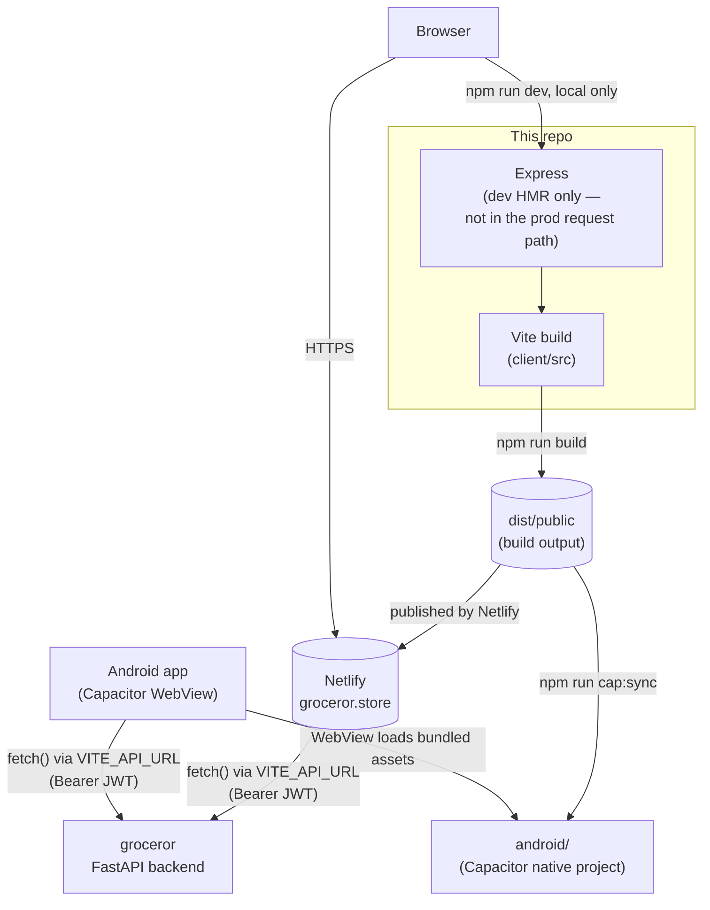

# Architecture

The one thing worth internalizing: **the client talks directly to the FastAPI backend over HTTPS** (`VITE_API_URL`) with a Bearer JWT in every request. There is no BFF, no server-side session, no proxy in production — `server/` (Express) only exists for local dev HMR and to serve the static build; it's never in the request path once deployed. That's also what makes Capacitor wrapping trivial (see below): the WebView just needs the same static bundle and the same API base URL, nothing else changes.

## Deployment

- **Web**: Netlify, auto-deployed on push to `main`. `npm run build` → `dist/public`, published per `netlify.toml`. Live at [groceror.store](https://groceror.store).
- **Android**: the *same* `dist/public` build, copied into `android/` via `npm run cap:sync` (Capacitor) and built/run from Android Studio. Not built by any CI pipeline yet — manual, on a machine with the Android SDK.
- **Backend**: this app is a pure client of [groceror](https://github.com/lordlabakdas/groceror) ([groceror.fly.dev](https://groceror.fly.dev)) — see that repo's `ARCHITECTURE.md` for what's on the other side of `VITE_API_URL`.

## Auth & data flow

1. Phone + OTP → `POST /user/send-otp` → `POST /user/verify-otp` → `POST /user/register` (or `/user/login` for existing accounts) → JWT stored in `localStorage`.
2. `client/src/lib/queryClient.ts` is the single fetch wrapper: prepends `VITE_API_URL`, injects `Authorization: Bearer <token>`, and is what every `useQuery`/`useMutation` call in `pages/` goes through.
3. The JWT's `entity_type` claim (`"user"` vs `"store"`) is decoded client-side (no round-trip) to gate routes (`StoreOwnerRoute`/`BuyerRoute` in `App.tsx`) and drive the navbar.

## Testing

`e2e/` (Playwright) is the only automated test coverage — there's no component/unit test suite. It runs against a **second, isolated instance** of the backend (`scripts/run_e2e_server.py` in the `groceror` repo) on a throwaway SQLite file, so it never touches the real Postgres/Twilio/Resend that local `.env` points at. See `CLAUDE.md` for how OTPs are retrieved without the removed debug endpoint.
